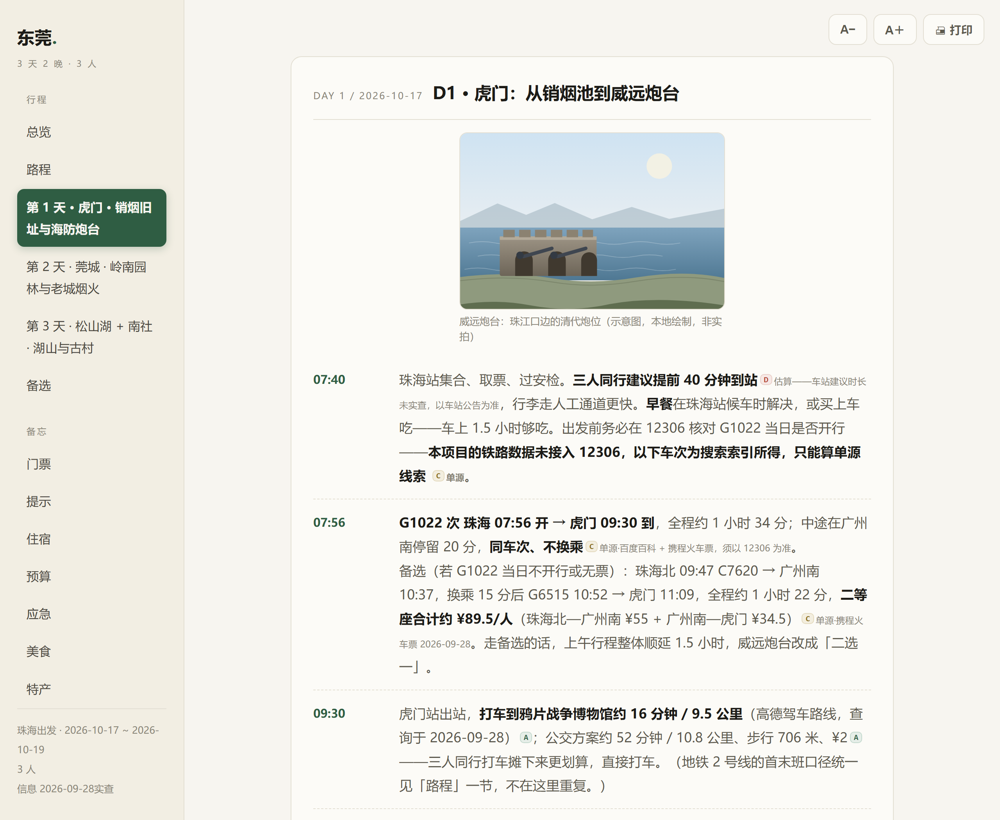

# Verified Travel Planner · verified-travel-planner

English | [简体中文](README.md)

> **Produces travel roadbooks where every number carries a source and every
> claim can be machine-verified.**
> *An Agent Skill that makes AI travel plans verifiable: every number carries
> an evidence grade, and gates check the deliverable before it ships.*

A Skill (capability package) for AI assistants: instead of ghostwriting a
pretty itinerary, it **verifies first, writes second, then audits itself** —
and refuses to deliver what fails the audit.

[](https://github.com/Tulip-557/verified-travel-planner/actions/workflows/gates.yml)
[](LICENSE)




▲ **Actual render** of the sample roadbook (Dongguan, 3 days): the taxi leg
"16 min / 9.5 km" carries an `[A]` (Amap measured), train fares `[C]` (single
source, re-check advised), closing hours `[A]` — and anything unverifiable is
written down as `[D]` with a way for *you* to verify it. **It never invents a
better-looking number.**
**[Open the sample roadbook →](https://tulip-557.github.io/verified-travel-planner/demo-dongguan.html)**
(GitHub Pages, single-file HTML, works offline; sample data verified 2026-09-28/10-02)

## The problem it solves

The failure mode of AI-written itineraries isn't prose — it's that **every
sentence looks equally trustworthy**:

```
"Amap reports an 18-minute drive"   ← machine-measured
"A guide says this area is lovely"  ← personal impression
"I heard tickets are ~300"          ← hearsay
```

Three lines, identical typography, three orders of magnitude apart in
reliability. And the cost of being wrong is real: closed museums, missed
last trains, doubled ticket prices.

## Three layers of "is it true"

| Layer | Gate | Question it answers | Fails when |
|---|---|---|---|
| 1 | `claim_audit` | Did measured values make it into the roadbook honestly? | A captured 16-min leg written up as 15 |
| 2 | `echo_audit` | Does the cited web page actually contain the claimed value? | A deadline-class claim's value is nowhere on the fetched page |
| 3 | `cross_check` | Are the "two independent sources" actually one family? | The two cited pages' texts overlap past the re-post threshold |

Layer 2 works on the fetched page text itself: value extraction accepts
Chinese numerals ("四十二分钟" ↔ 42), picks the best match across several
sources, and falls back to a JS shell; a page it cannot fetch is a WARN,
never a FAIL ("cannot see" ≠ "is not there"). Layer 3 catches re-posts by
4-gram overlap between the two cited pages' texts. All three still prove only
**claim = capture = page + independence** — never "the page is right".

Plus: four evidence grades (`[A]` tool-measured / `[B]` two-source / `[C]`
single-source / `[D]` unverified, rendered as colored badges), deterministic
feasibility checking (closing-time conflicts, transfer margins, budget
closure — `INFEASIBLE` refuses to ship), byte-exact render reproduction, and
a self-referential validator that even checks the counts claimed in the docs.

**Nine gates, one command:**

```bash
python verified-travel-planner/tools/ship.py     # all green or exit code 2
```

**Two sidecar tools** cover what gates can't see: `bulletin.py` sweeps
pre-departure announcements (closures / price changes / traffic controls /
openings / events) and validates their evidence grade — announcement-class
deadlines accept `[A]` only; `review_trust.py` flags shill/promo **signals**
in review sections (template repetition, promo markers, stance-text mismatch,
same-day bursts) — signals, never verdicts, no "adjusted rating".

## 30-second start

```bash
# 1) Install into your AI client (Claude Code / Codex / Cursor / …)
npx skills add Tulip-557/verified-travel-planner

# 2) Configure an Amap key (optional; without it every fact degrades to [D])
python verified-travel-planner/tools/set_amap_key.py

# 3) Environment doctor: 8 checks, core items must be READY
python verified-travel-planner/tools/doctor.py
```

## What it deliberately does not do

- **No platform crawlers built in.** Xiaohongshu/Douyin IP-rate-limit,
  Dianping font-obfuscation + signature arms races — packaging a capability
  that breaks next month would be self-deception. Three channels instead:
  official releases, search indexes, user-provided material.
- **No "adjusted rating" after shill filtering.** Review signals (template
  repetition, promo markers, stance-text mismatch, same-day bursts) are
  **signals, never verdicts** — Yelp's lesson is that machine-judged
  authenticity mass-murders genuine first-time reviewers.
- **No inventing numbers.** Without map capability, distances are `[D]` —
  never a plausible-looking guess.
- **No future weather** in plans; the ~4-day forecast window is a
  departure-week tool.

## Honest boundary

The three layers prove **claim = capture = page + independence**. They do
*not* prove the page itself is right: paraphrase evades phrase-matching,
JS pages the headless browser can't render stay `UNREACHABLE`, and a source
page that is simply wrong is invisible to the chain. Every deliverable ships
an **unverified-items list** — that is the final safety net, and re-checking
against official channels before departure is *your* move.

## Install & use

| Requirement | |
|---|---|
| Python | 3.9+ (stdlib only, zero pip installs; Windows needs `tzdata`) |
| Amap key | optional but strongly recommended (live data → `[A]` grades) |

```bash
python verified-travel-planner/tools/doctor.py              # environment
python verified-travel-planner/tools/travel_planner.py --help   # 14 commands
python verified-travel-planner/tools/ship.py --quick        # regression
```

Sample roadbooks live in `产出示例/` (Dongguan = full delivery chain,
Chengdu = byte-exact render fixture). Full design docs (Chinese) are under
`verified-travel-planner/references/` — start with `echo-cross.md` for the
verification layers and `review-connectors.md` if you want to plug in a
local crawler.

## License

MIT, with upstream attributions in `THIRD_PARTY_NOTICES.md` (derived from
two MIT-licensed projects; keep both files when redistributing). External
services (Amap etc.) have their own terms and quotas — you apply for the key
and comply.
